# Windows Kernel Programming Tutorials

The following are my notes taken while going through [Programming LoL's](https://www.youtube.com/@y0011langester) youtube series on Windows Kernel Programming. Full credit on all of this information goes to him, these are simply notes for me to reference later :)

Hope it helps!

# Table of Contents

- [Setting up Environment](#setting-up-environment)
- [Writing a Simple Driver](#writing-a-simple-driver)
- [Troubleshooting Driver Issues](#troubleshooting-driver-issues)
- [Strings](#strings)
  - [Initializing Strings](#initializing-strings)
  - [Copying strings](#copying-strings)
  - [Converting to UpperCase](#converting-to-uppercase)
  - [Converting UNICODE to ANSI](#converting-unicode-to-ansi)
- [Memory Management](#memory-management)
  - [A closer look at ExAllocatePoolWithTag](#a-closer-look-at-exallocatepoolwithtag)
- [Time & Timer](#time--timer)


# Setting up Environment

In this tutorial we're gonna be installing the [Windows Driver Kit (WDK)](https://learn.microsoft.com/en-us/windows-hardware/drivers/other-wdk-downloads), it's important by now we have a solid understanding of C as that will be the language of choice for our development. We'll need to install 3 things into our virtual machine (**I'll be using Windows 10 x64**) in the following order:

1. Visual Studio (**I'll be using Visual Studio 2022**)
2. SDK
3. WDK
4. OSR Loader

I won't go into the details of the VM since I've done it so many times, but @y0011langester gives more details on his youtube channel. Part 2 of this tutorial covers installing [VirtualKD](https://sysprogs.com/legacy/virtualkd/), but since I had already installed my debugger using named pipes, I figured I will learn this later.

# Writing a Simple Driver

Open Visual Studio to create a new project and select the **Empty WDM Driver** template.

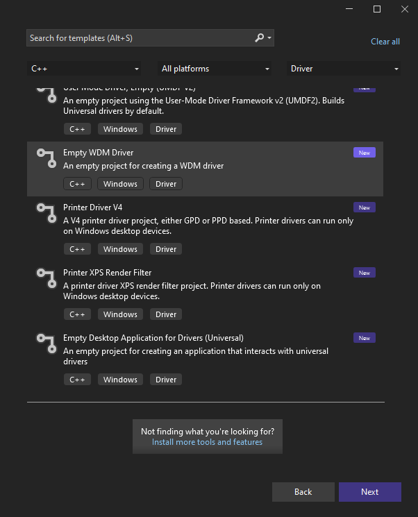

Once selected, name it what you want and create it. You should see no source files so we'll have to create one (Note: you will have to change extension from .CPP to .C). Like most C code, we'll need to include any relevant header files, notably we won't be able to use most of C and Windows user-mode libraries. In Windows Kernel programming, we'll generally use `ntddk.h`. Next, we need the `DriverEntry` function (look at this like the main() function in C):

```c
#include "ntddk.h"

NTSTATUS DriverEntry(IN PDRIVER_OBJECT DriverObject, IN PUNICODE_STRING RegistryPath)
{
}
```

What's NTSTATUS, PDRIVER_OBJECT, etc? If you hover over each variable type it will give you a short description, for example NTSTATUS is an alias (typedef) for a LONG. You can also click the function or variable type and hit `[F1]` to bring up the relavent MSDN. When you see the `IN` macro this let's us know it's an input argument, `OUT` means we need to return some value to said argument. `IN / OUT` macros are not absolutely necessary when programming a DriverEntry. Let's take a look at the first argument the **DRIVER_OBJECT**. Consider this structure to be a representation of our driver. We can take a look at its definition by right-clicking it and going to its defintion (or hitting [F12]).

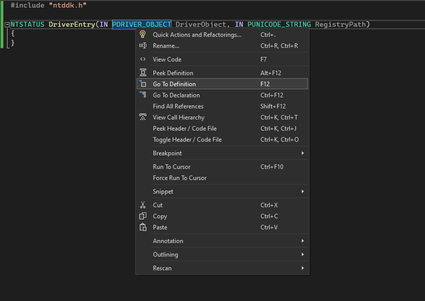

The driver object has lot's of members, but for now we just need to focus on the DriverUnload member.

```c
    //
    // The following section describes the entry points to this particular
    // driver.  Note that the major function dispatch table must be the last
    // field in the object so that it remains extensible.
    //

    PDRIVER_INITIALIZE DriverInit;
    PDRIVER_STARTIO DriverStartIo;
    PDRIVER_UNLOAD DriverUnload;
    PDRIVER_DISPATCH MajorFunction[IRP_MJ_MAXIMUM_FUNCTION + 1];
```

If we assign a function pointer to the `DriverUnload` member, when the driver is unloaded, Windows will call this function proir to the driver being unloaded. Let's go ahead and write some code. To write our hello world, we'll use `DbgPrint()` because we cannot use printf in Kernel mode. Then we'll need to return STATUS_SUCCESS, this is necessary in order to have Windows load our driver.

```c
#include "ntddk.h"

NTSTATUS DriverEntry(IN PDRIVER_OBJECT DriverObject, IN PUNICODE_STRING RegistryPath)
{
	DbgPrint("Hello from Kernel land o/ \r\n");
	return STATUS_SUCCESS;
}
```

Now we need to write our unload function so our driver is unloadable. To do this we'll add a function pointer to the `DriverUnload` member in the `DriverObject` structure. The unload function we write only requires one argument - a pointer to the driver object.

```c
#include "ntddk.h"

VOID Unload(IN PDRIVER_OBJECT DriverObject)
{
	DbgPrint("Goodbye from Kernel land o/ \r\n");
}

NTSTATUS DriverEntry(IN PDRIVER_OBJECT DriverObject, IN PUNICODE_STRING RegistryPath)
{
	DriverObject->DriverUnload = Unload;

	DbgPrint("Hello from Kernel land o/ \r\n");
	return STATUS_SUCCESS;
}
```

Proir to compiling make sure that the build targets your OS archetecture! We also need to change some setting in Visual Studio. First I needed to delete the `.inf` file in the Driver Files section. Next you'll need to disable spectre mitigations in the C++ settings.

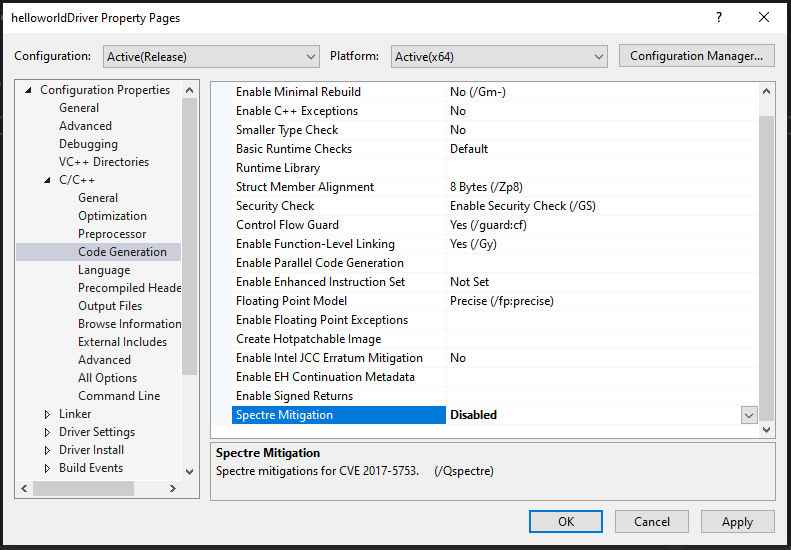

Within the C++ settings I also had to set the warning settings to 1 and disable treating warnings as Errors.

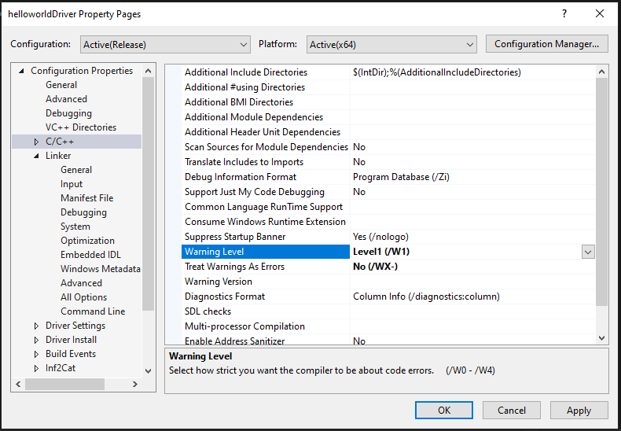

Next, I needed to disable treating warnings as errors in the linker:

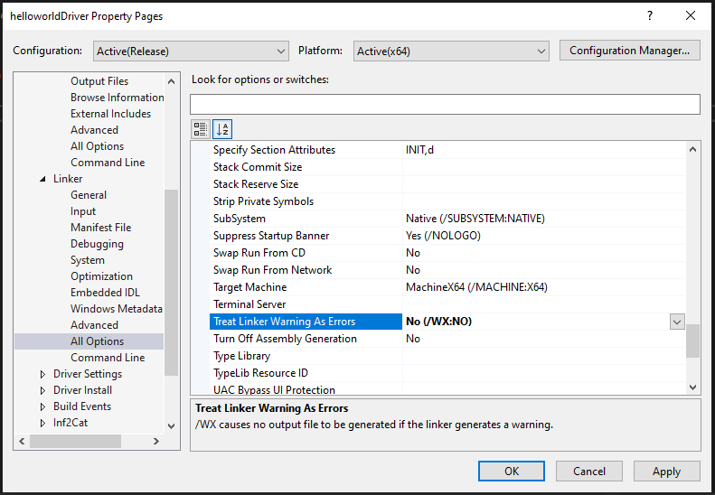

Upon completion I had successfully compiled my first driver! In the output of the build we can get the location of the compiled driver. Before loading the driver I rebooted the machine and attached WinDbg to the kernel. Once attached I simply loaded the driver using the OSR loader (`Register`, then `Start Service`).

However we got no output? What happened? Well we need to enable Debug prints - to do this we'll create a new key into registry. We can do it with the following command as an administrator:

```
reg add "HKLM\SYSTEM\CurrentControlSet\Control\Session Manager\Debug Print Filter" /V DEFAULT /t REG_DWORD /d 0xf
```

Once completed, I went ahead and rebooted. Once loaded with OSR loader, we get our hello world :)

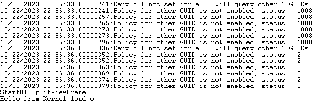

# Troubleshooting Driver Issues

Let's create a program with an intentional flaw, when compiling make sure to use `Debug` mode instead of `Release`. Source code down below:

```c
#include "ntddk.h"

VOID Unload(IN PDRIVER_OBJECT DriverObject)
{
	DbgPrint("Goodbye from Kernel land o/ \r\n");
}

NTSTATUS DriverEntry(IN PDRIVER_OBJECT DriverObject, IN PUNICODE_STRING RegistryPath)
{
	PCHAR string = NULL;

	DriverObject->DriverUnload = Unload;

	*string = 'a'; // invalid pointer address

	DbgPrint("Hello from Kernel land o/ \r\n");
	return STATUS_SUCCESS;
}
```

Before loading make sure that the debug symbols are on your host machine running WinDbg, in my case I had to copy them over since I'm compiling on the VM. Example of my config below:

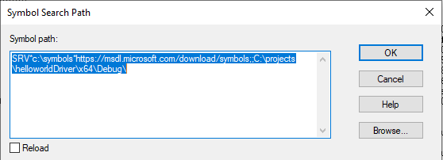

Once done, load the driver and you'll get a crash. Run `!analyze -v`, this tells us the exact line where the error occurs:

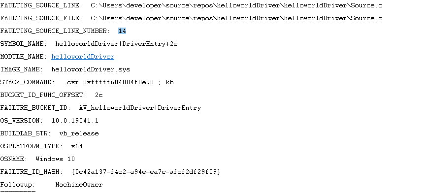

It's important we tackle flaws like this immediatley when developing kernel drivers, since a crash in kernel land means the whole system will go down.

# Strings

There are four types of strings we need to be aware of:

- CHAR
- WCHAR
- UNICODE_STRING
- ANSI_STRING

CHAR and WCHAR strings are NULL-terminated strings, whereas UNICODE_STRINGs and ANSI_STRINGs are string structures. It's important to know both UNICODE and ANSI string structures do not guarantee that they will point to a NULL terminated string. First let's look at the structure definition of a **UNICODE_STRING**.

```c
typedef struct _UNICODE_STRING {
    USHORT Length;
    USHORT MaximumLength;
#ifdef MIDL_PASS
    [size_is(MaximumLength / 2), length_is((Length) / 2) ] USHORT * Buffer;
#else // MIDL_PASS
    _Field_size_bytes_part_opt_(MaximumLength, Length) PWCH   Buffer;
#endif // MIDL_PASS
} UNICODE_STRING;
typedef UNICODE_STRING *PUNICODE_STRING;
typedef const UNICODE_STRING *PCUNICODE_STRING;
```

The `Length` member tells us how many bytes the string pointed by `Buffer` is using. The `MaximumLength` is the bytes of memory allocated for the string buffer. The string that tlhe `Buffer` member points to is a wide-character string. Now let's look at  **ANSI_STRING**.

```c
typedef struct _STRING {
    USHORT Length;
    USHORT MaximumLength;
#ifdef MIDL_PASS
    [size_is(MaximumLength), length_is(Length) ]
#endif // MIDL_PASS
    _Field_size_bytes_part_opt_(MaximumLength, Length) PCHAR Buffer;
} STRING;
typedef STRING *PSTRING;
typedef STRING ANSI_STRING;
```

When looking at this structure we see similiar operation, only this time we see that `Buffer` points to a character string vs a wide character string.

## Initializing Strings

Let's go ahead and look at the different ways to initialize a UNICODE_STRING using C:

```c
	// Three methods of Initializing a UNICODE_STRING
	//
	// 1.
	UNICODE_STRING string1 = RTL_CONSTANT_STRING(L"Hello I'm a UNICODE_STRING\r\n");

	// 2.
	UNICODE_STRING string2 = { 0 };
	RtlInitUnicodeString(&string2, L"Hello, I'm also a UNICODE_STRING\r\n");

	// 3.
	UNICODE_STRING string3 = { 0 };
	WCHAR str[120] = { 0 };

	string3.Buffer = str;
	string3.MaximumLength = 120;
	string3.Length = wcslen(L"Me too, I'm a UNICODE_STRING\r\n") * sizeof(WCHAR);

	wcscpy(string3.Buffer, L"Me too, I'm a UNICODE_STRING\r\n");


	DbgPrint("Hello from Kernel land o/ \r\n");
	DbgPrint("%wZ", string1);
	DbgPrint("%wZ", string2);
	DbgPrint("%wZ", string3);
```

Once loaded, we see our strings in WinDBG :)


## Copying strings

Next, let's take a look at copying strings, we can do so using the `RtlCopyUnicodeString()` function as shown below.

```c
	// Copying strings
	UNICODE_STRING src = RTL_CONSTANT_STRING(L"I'm originally in the src variable\r\n");
	UNICODE_STRING dst = { 0 };

	WCHAR newBuffer[60];
	dst.Buffer = newBuffer;
	dst.Length = dst.MaximumLength = 60;

	RtlCopyUnicodeString(&dst, &src);

	DbgPrint("%wZ\r\n", src);
```

## Converting to UpperCase

To convert a string to UpperCase we can use the `RtlUpcaseUnicodeString()` function. It takes three parameters but the one that is the most unique is the `AllocateDestinationString` argument.

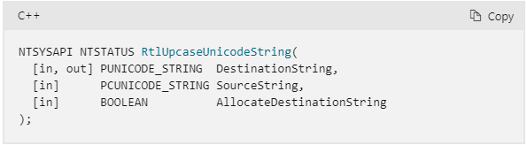

When `AllocateDestinationString` is set to **TRUE**, `RtlUpcaseUnicodeString()` will allocate a string buffer for us. This is important to know as we'll need to later free it using `RtlFreeUnicodeString()` as shown B-LOW:

```c
	// Uppercasing strings
	UNICODE_STRING lSrc = RTL_CONSTANT_STRING(L"I will change to uppercase\r\n");
	UNICODE_STRING dSrc = { 0 };

	RtlUpcaseUnicodeString(&dSrc, &lSrc, TRUE);

	DbgPrint("%wZ\r\n", lSrc);
	DbgPrint("%wZ\r\n", dSrc);

	RtlFreeUnicodeString(&dSrc);
```

## Converting UNICODE to ANSI

Next, we'll demonstrate converting UNICODE to ANSI. This process will be the same when converting a ANSI string to UNICODE, it would just require different functions. In this case, we'll be using `RtlUnicodeStringToAnsiString()`. Looking at the Microsoft documentation we can see this is no different from the last example:

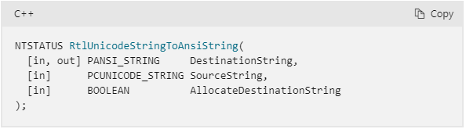

Let's look at some code:

```c
	// Converting from UNICODE to ANSI
	UNICODE_STRING srcUnicode = RTL_CONSTANT_STRING(L"I'm going to be turned into ANSI\r\n");
	ANSI_STRING dstAnsi = { 0 };

	RtlUnicodeStringToAnsiString(&dstAnsi, &srcUnicode, TRUE);

	DbgPrint("%Z", dstAnsi);

	RtlFreeAnsiString(&dstAnsi);
```

Pretty simple, you may see a few changes to the prevous code we've written but nothing that shouldn't make sense. We use `%Z` since we're printing ANSI, and this time we call `RtlFreeAnsiString()` since we allocated an ANSI string.

# Memory Management

This next tutorial has to do with memory allocation in the Windows Kernel. When we deal with C we normally think of using `malloc()`. However, in the Kernel we instead use the `ExAllocatePoolWithTag()` function.

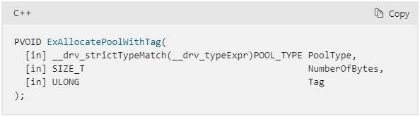

Let's go ahead and write some code.

```c
#include "ntddk.h"

VOID Unload(IN PDRIVER_OBJECT DriverObject)
{
	DbgPrint("Goodbye from Kernel land o/ \r\n");
}

NTSTATUS DriverEntry(IN PDRIVER_OBJECT DriverObject, IN PUNICODE_STRING RegistryPath)
{
	DriverObject->DriverUnload = Unload;

	UNICODE_STRING srcString = RTL_CONSTANT_STRING(L"HI\r\n");
	UNICODE_STRING string = { 0 };

	string.Buffer = (PWCHAR)ExAllocatePoolWithTag(NonPagedPool, 10, "fooo");
	if (NULL != string.Buffer)
	{
		string.Length = string.MaximumLength = 4;

		RtlCopyMemory(string.Buffer, srcString.Buffer, srcString.Length);
		DbgPrint("%wZ\r\n", &string);
		ExFreePool(string.Buffer);
	}

	return STATUS_SUCCESS;
}
```

There are many PoolTypes we could have used however, the most common are NonPagedPool and PagedPool. The difference between paged and nonpaged pool is, the paged pool can be paged out of memory.

The second parameter is simple, the allocation size, however the third parameter may not look familiar. Basically, this tag is used for developers to debug allocations, and this tag is a method of tracking said allocations.

## A closer look at ExAllocatePoolWithTag

For this example we'll be using the following code:

```c
#include "ntddk.h"

VOID Unload(IN PDRIVER_OBJECT DriverObject)
{
	DbgPrint("Goodbye from Kernel land o/ \r\n");
}

NTSTATUS DriverEntry(IN PDRIVER_OBJECT DriverObject, IN PUNICODE_STRING RegistryPath)
{
	DriverObject->DriverUnload = Unload;

	UNICODE_STRING srcString = RTL_CONSTANT_STRING(L"HI\r\n");
	UNICODE_STRING string = { 0 };

	string.Buffer = (PWCHAR)ExAllocatePoolWithTag(NonPagedPool, 10, "fooo");
	if (NULL != string.Buffer)
	{
		string.Length = string.MaximumLength = 4;

		RtlCopyMemory(string.Buffer, srcString.Buffer, srcString.Length);

		// Copying characters into the poolheader using strcpy (the pool header is 16 bytes in x64)
		strcpy(string.Buffer-0x10, "AAAAAAAAAAAAAAAAAAAAAAAAAAAAAAAAA");

		DbgPrint("%wZ\r\n", &string);
		ExFreePool(string.Buffer);
	}

	return STATUS_SUCCESS;
}
```

Whenever an allocation is made using `ExAllocatePoolWithTag()` each allocation has a header that we don't see. We can see a high level view of this below:

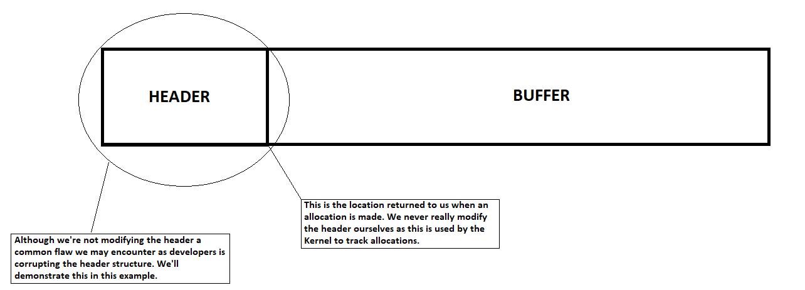

Now let's look at this in WinDbg. To dump this header structure we'll use the `dt` command.

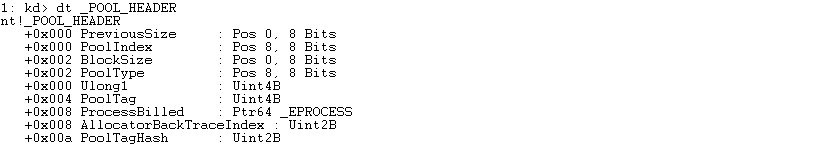

The main members we're going to be looking at are the PreviousSize, BlockSize, PoolType and PoolTag. The next thing we need to do is setup a breakpoint on our driver to see this, in order to do that we need to break once the driver is loaded. To do this we'll use the command `sxe ld helloworldDriver` where helloworldDriver would be the name of your driver. This command will break on entry regardless of our symbols. Once we break we can make sure that the symbols are loaded, and we can load the source code as well.

With the symbols and source loaded, let's break on `DriverEntry`.

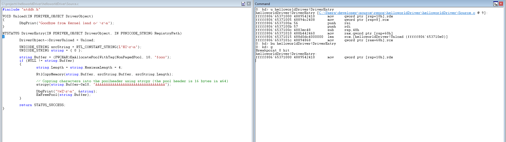

If we dump the assembly (`u`), we'll see the call to `ExAllocatePoolWithTag()`. Let's go ahead and set a breakpoint after the call is complete.

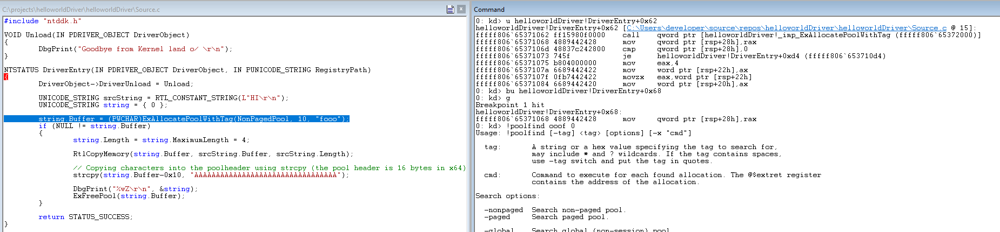

Once the call completes, we can see the header using `dt` once more. Before using that command, we run `!pool rax` which will display information about our allocation. Once done we see that our header starts at 0xffffe48972b02a40 (exactly as we expected: rax - 16 bytes).

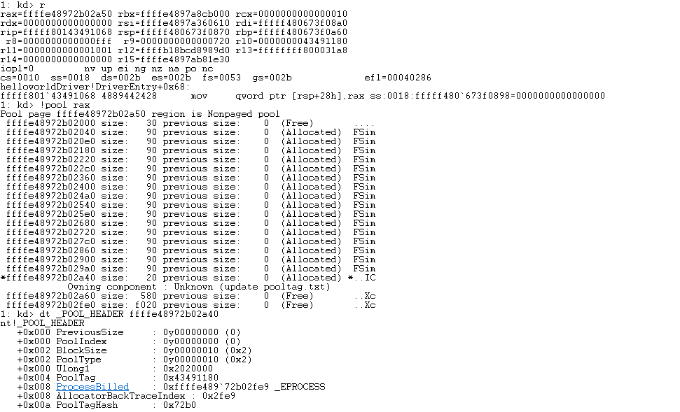

If we continue stepping, we eventually reach the `strcpy()` call. When executed, we can see we corrupt the POOL_HEADER.

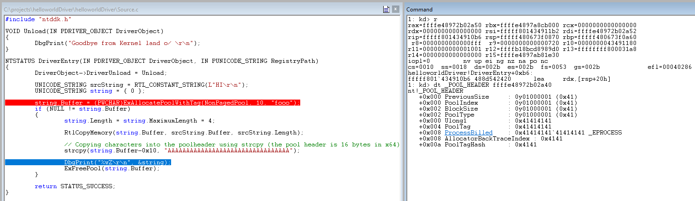

However, the debugger does not alert us of this, only when we trigger the free, do we see a crash.

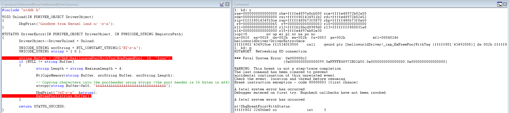

If we run `!analyze -v` we confirm that the header has been corrupted!

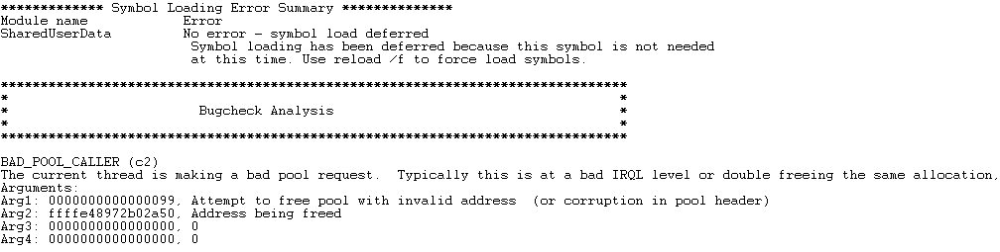

It's important to know the underlying operations of Kernel allocations since the corruption occured before the free. Meaning, we as developers need to hunt down the bug and see exactly where it occurred. Looking at the backtrace is a good place to start.

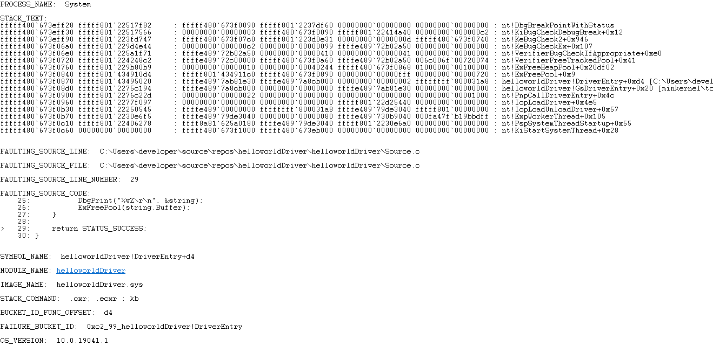

WinDbg can only detect these issues once it's too late, so having an idea what could have happenend is very important.

# Time & Timer

This section will be covering how to query system time and delay our thread for a certain period of time. The first function we'll be using is `KeQuerySystemTime()`. The function prototype is shown below:

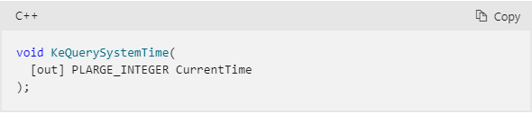

This function returns a count of 100-nanosecond intervals since January 1, 1601. We then need to adjust this value to the local time zone using `ExSystemTimeToLocalTime()`.

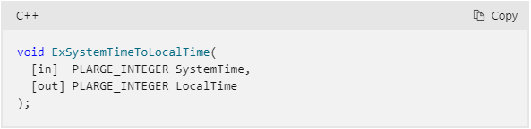

With these to calls complete we can then call `RtlTimeToTimeFields()` to get the human readable time.

# Sources

```
https://youtu.be/XUlbYRFFYf0?si=YVQdaID2bDHb48nD
https://youtu.be/Nc-uh8O989I?si=mw_fz74N6hKoJKIV
https://youtu.be/D9NncWmVDz0?si=sAISqaDi-ciz8UBg
https://youtu.be/AZZmbNWT-kw?si=pvn6HGLPViD91b70

https://learn.microsoft.com/en-us/windows-hardware/drivers/ddi/wdm/nf-wdm-kequerysystemtime-r1
https://learn.microsoft.com/en-us/windows-hardware/drivers/download-the-wdk
https://learn.microsoft.com/en-us/windows-hardware/drivers/other-wdk-downloads
https://www.osronline.com/article.cfm%5Earticle=157.htm
https://sysprogs.com/legacy/virtualkd/
https://stackoverflow.com/questions/25963345/how-to-enable-kernel-traces-in-windbg
```                                                                